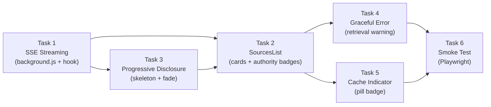

# Stage 2 — Frontend Implementation Plan
## Credibility Evaluator Browser Extension

> **Goal:** Upgrade the frontend from a single JSON response model to an SSE streaming architecture with progressive UI rendering, source cards, graceful degradation, cache indicators, and a smoke test.

---

## Current State Summary

| Layer | File | Current Behavior |
|-------|------|-----------------|
| Background worker | [background.js](file:///c:/Users/phucn/OneDrive/Documents/check-fake-new-extension/extension/background.js) | Relays `TEXT_SELECTED` messages between content script and sidebar. **Does not call the API** — the sidebar does the fetch directly. |
| Content script | [content.js](file:///c:/Users/phucn/OneDrive/Documents/check-fake-new-extension/extension/content.js) | Captures `mouseup` text selection, sends `TEXT_SELECTED` message. |
| Sidebar (React) | [App.jsx](file:///c:/Users/phucn/OneDrive/Documents/check-fake-new-extension/sidepanel-src/src/App.jsx) | Single `fetch()` → `response.json()` call to `/analyze`. Renders raw JSON in a `<pre>` block. No structured result display. |
| Styles | [App.css](file:///c:/Users/phucn/OneDrive/Documents/check-fake-new-extension/sidepanel-src/src/App.css) + [index.css](file:///c:/Users/phucn/OneDrive/Documents/check-fake-new-extension/sidepanel-src/src/index.css) | Design system with CSS variables (light/dark), Inter font, basic animations. Uses Tailwind v4 import. |
| Build | [vite.config.js](file:///c:/Users/phucn/OneDrive/Documents/check-fake-new-extension/sidepanel-src/vite.config.js) | Vite builds into `../extension/assets/` with deterministic filenames. |

> [!IMPORTANT]
> **Architecture shift:** In Stage 1, the sidebar calls the API directly. In Stage 2, the **background worker** must handle the SSE stream (because service workers can use `fetch` + `ReadableStream`, and this keeps the API logic out of the UI layer). The sidebar becomes a pure message consumer.

---

## User Review Required

> [!WARNING]
> **Breaking change to data flow.** The fetch logic moves from `App.jsx` → `background.js`. This means:
> 1. The sidebar no longer calls `/analyze` directly.
> 2. The background worker becomes the SSE consumer and forwards parsed events to the sidebar via `chrome.runtime.sendMessage`.
> 3. The sidebar's `handleAnalyze` will send an `ANALYZE_REQUEST` message to the background worker instead of calling `fetch`.

> [!IMPORTANT]
> **Backend dependency.** This plan assumes the backend already supports `POST /analyze` with `Content-Type: text/event-stream` SSE responses in the format described in the Stage 2 spec (events: `score`, `sources`, `cached`, `error`, `done`). If the backend is not ready yet, we can build and test the frontend with a **mock SSE server** (included in the plan).

---

## Proposed Changes

### Component Architecture After Stage 2

```
Sidebar (App.jsx)
├── Header (existing)
├── Selected Text Section (existing)
├── Analyze Button (existing — modified to send message instead of fetch)
├── ScoreBadge (NEW) — renders on `score` event
│   └── CachedIndicator (NEW) — renders on `cached` event
├── ExplanationPanel (NEW) — renders on `score` event
├── RetrievalWarning (NEW) — renders on `error` event (task=retrieval)
├── SourcesSection (NEW)
│   ├── SourcesSkeleton (NEW) — visible between score and sources events
│   └── SourcesList (NEW) — replaces skeleton on `sources` event
│       └── SourceCard (NEW) × N
└── Footer (existing)
```

---

### 1. Background Worker — SSE Streaming

#### [MODIFY] [background.js](file:///c:/Users/phucn/OneDrive/Documents/check-fake-new-extension/extension/background.js)

**What changes:**
- Add a new `ANALYZE_REQUEST` message handler that calls `POST /analyze` using `fetch()` + `ReadableStream`.
- Parse the SSE text buffer into `event`/`data` pairs (cannot use `EventSource` — it only supports GET and is blocked in MV3 service workers).
- Forward each parsed event to the sidebar via `chrome.runtime.sendMessage` with type `SSE_EVENT`.
- Implement a **5-second hard timeout** using `AbortController`. If `done` hasn't arrived, send a `SSE_EVENT` with event `timeout` to trigger degraded mode.
- Keep existing `TEXT_SELECTED` relay logic unchanged.

**SSE parsing strategy:**
```
Buffer incoming text chunks.
Split on double newline (\n\n) to get complete events.
For each event block:
  - Extract `event:` line → event name
  - Extract `data:` line → JSON.parse the value
  - Forward: { type: 'SSE_EVENT', event: name, data: parsed }
Keep any incomplete trailing text in the buffer for the next chunk.
```

**Message protocol (background → sidebar):**

| Message type | Event name | Payload |
|-------------|-----------|---------|
| `SSE_EVENT` | `score` | `{ score, confidence, explanation }` |
| `SSE_EVENT` | `sources` | `{ sources: [{ url, domain, excerpt, authority }] }` |
| `SSE_EVENT` | `cached` | `{ cache_type: 'exact' \| 'semantic' }` |
| `SSE_EVENT` | `error` | `{ task: 'retrieval', message: '...' }` |
| `SSE_EVENT` | `done` | `{}` |
| `SSE_EVENT` | `timeout` | `{}` (synthetic, sent by background on 5s timeout) |

---

### 2. Sidebar — State Management Refactor

#### [MODIFY] [App.jsx](file:///c:/Users/phucn/OneDrive/Documents/check-fake-new-extension/sidepanel-src/src/App.jsx)

**What changes:**
- Remove the direct `fetch()` call from `handleAnalyze`.
- Replace with `chrome.runtime.sendMessage({ type: 'ANALYZE_REQUEST', text: selectedText })`.
- Add a `chrome.runtime.onMessage` listener for `SSE_EVENT` messages.
- Replace the single `result` state with granular state slices:

```jsx
const [score, setScore] = useState(null)           // from 'score' event
const [sources, setSources] = useState(null)        // from 'sources' event  
const [cached, setCached] = useState(null)           // from 'cached' event
const [retrievalError, setRetrievalError] = useState(false) // from 'error' event
const [streamDone, setStreamDone] = useState(false)  // from 'done' event
const [streamPhase, setStreamPhase] = useState('idle') 
// phases: 'idle' | 'waiting' | 'score-received' | 'complete' | 'degraded'
```

- Extract the SSE event dispatcher into a `useSSEListener` custom hook in `hooks/useSSEListener.js`.
- Replace the raw JSON `<pre>` block with structured components.

---

### 3. New Components

All new components go in `sidepanel-src/src/components/`.

#### [NEW] `components/ScoreBadge.jsx`

Renders the numerical credibility score (0–100) in a circular or pill badge with colour coding based on confidence:
- `HIGH` → green border/accent
- `MEDIUM` → amber border/accent
- `LOW` → red border/accent  
- `UNVERIFIABLE` → grey, muted

Displays the confidence level text below the score number.

#### [NEW] `components/CachedIndicator.jsx`

Small pill badge near the score. Only renders when `cached` state is not null.
- `exact` → tooltip: "Identical text retrieved from cache"
- `semantic` → tooltip: "Similar claim retrieved from cache"
- Muted colour, small font (11px), no distraction from score.

#### [NEW] `components/ExplanationPanel.jsx`

Renders the plain-English explanation text from the `score` event. Simple card with readable typography. Renders simultaneously with `ScoreBadge`.

#### [NEW] `components/SourcesSection.jsx`

Container that manages the skeleton → list transition:
- When `streamPhase === 'score-received'` and `sources === null` → show `SourcesSkeleton`
- When `sources !== null` → fade in `SourcesList`, fade out skeleton
- When `retrievalError === true` → show `RetrievalWarning` instead

#### [NEW] `components/SourcesSkeleton.jsx`

3–4 grey animated pulse bars with a "Checking sources…" label above them. Pure CSS animation (`@keyframes pulse`), no animation library.

#### [NEW] `components/SourcesList.jsx`

Renders a list of `SourceCard` components. Props: `sources[]`, `confidence`.
- Collapsed by default when confidence is `HIGH`
- Expanded by default when confidence is `MEDIUM` or `LOW`
- "No sources found" message when array is empty but no retrieval error.

#### [NEW] `components/SourceCard.jsx`

Individual source card displaying:
- Domain name in bold (truncated with ellipsis if > 30 chars)
- Excerpt (max 2–3 lines, CSS `line-clamp: 3`)
- Authority badge:
  - `≥ 0.75` → green badge "High"
  - `0.45–0.74` → amber badge "Medium"  
  - `< 0.45` → red badge "Low"
- Entire card is a clickable link to the source URL (opens in new tab).

#### [NEW] `components/RetrievalWarning.jsx`

Non-blocking warning banner:
- ⚠️ icon + "Sources unavailable — score based on AI reasoning only"
- Amber/yellow background, not red (this is degraded state, not failure)
- Does NOT replace the score/explanation — those still render normally.

#### [NEW] `hooks/useSSEListener.js`

Custom hook that encapsulates the `chrome.runtime.onMessage` listener for `SSE_EVENT` messages. Returns the state slices and a `reset()` function. Keeps `App.jsx` clean.

---

### 4. Styles

#### [MODIFY] [App.css](file:///c:/Users/phucn/OneDrive/Documents/check-fake-new-extension/sidepanel-src/src/App.css)

**Add styles for:**

| Class | Purpose |
|-------|---------|
| `.score-badge` | Circular/pill score display with confidence-based border colour |
| `.score-badge--high / --medium / --low / --unverifiable` | Colour modifiers |
| `.cached-indicator` | Muted pill badge, small font |
| `.explanation-panel` | Card for explanation text |
| `.sources-section` | Container with fade transition |
| `.sources-skeleton` | Pulse animation bars |
| `.sources-skeleton__bar` | Individual animated bar (varying widths) |
| `.source-card` | Card with domain, excerpt, authority badge |
| `.authority-badge--high / --medium / --low` | Green/amber/red badges |
| `.retrieval-warning` | Amber warning banner |
| `.fade-in` | CSS `@keyframes fadeIn` for skeleton → list transition |

**Key CSS animations (no libraries):**

```css
@keyframes pulse {
  0%, 100% { opacity: 0.4; }
  50% { opacity: 0.8; }
}

.sources-section--entering {
  animation: fadeIn 0.3s ease forwards;
}
```

#### [MODIFY] [index.css](file:///c:/Users/phucn/OneDrive/Documents/check-fake-new-extension/sidepanel-src/src/index.css)

Add new CSS variables for the authority badge colours and the warning banner:

```css
--authority-high: #22c55e;
--authority-medium: #f59e0b; 
--authority-low: #ef4444;
--warning-bg: rgba(245, 158, 11, 0.1);
--warning-border: rgba(245, 158, 11, 0.3);
--cached-bg: rgba(148, 163, 184, 0.15);
```

(Plus dark mode variants.)

---

### 5. Mock SSE Server (for frontend-only development)

#### [NEW] `sidepanel-src/scripts/mock-sse-server.js`

A small Node.js script that mimics the backend SSE stream:
- Listens on `http://localhost:8000/analyze` (POST)
- Sends `score` event after 800ms
- Sends `sources` event after 2000ms (or `error` event if query param `?fail=retrieval` is set)
- Optionally sends `cached` event
- Sends `done` event at the end

This lets us develop and test the entire frontend without the real backend.

---

### 6. Smoke Test

#### [NEW] `tests/e2e/smoke.spec.js`

Playwright test that:
1. Loads the unpacked extension into a Chromium instance
2. Navigates to a mocked page with a known claim
3. Simulates text selection + context menu trigger (or injects `TEXT_SELECTED` message)
4. Waits for the sidebar to render
5. Asserts within 5 seconds:
   - Score badge shows a number 0–100
   - At least one source card is visible OR the "Sources unavailable" warning is shown
   - No JS console errors in the extension context
6. Add Playwright config and test script to `package.json`

---

## File Change Summary

| Action | Path | Task |
|--------|------|------|
| MODIFY | `extension/background.js` | Task 1 — SSE streaming |
| MODIFY | `sidepanel-src/src/App.jsx` | Task 1, 2, 3, 4, 5 — State refactor + component composition |
| MODIFY | `sidepanel-src/src/App.css` | Task 2, 3, 4, 5 — New component styles |
| MODIFY | `sidepanel-src/src/index.css` | Task 2, 4, 5 — New CSS variables |
| NEW | `sidepanel-src/src/hooks/useSSEListener.js` | Task 1 — SSE message handling hook |
| NEW | `sidepanel-src/src/components/ScoreBadge.jsx` | Task 2 — Score display |
| NEW | `sidepanel-src/src/components/CachedIndicator.jsx` | Task 5 — Cache pill |
| NEW | `sidepanel-src/src/components/ExplanationPanel.jsx` | Task 2 — Explanation card |
| NEW | `sidepanel-src/src/components/SourcesSection.jsx` | Task 2, 3 — Sources container + skeleton/list transition |
| NEW | `sidepanel-src/src/components/SourcesSkeleton.jsx` | Task 3 — Skeleton placeholder |
| NEW | `sidepanel-src/src/components/SourcesList.jsx` | Task 2 — Source cards list |
| NEW | `sidepanel-src/src/components/SourceCard.jsx` | Task 2 — Individual source card |
| NEW | `sidepanel-src/src/components/RetrievalWarning.jsx` | Task 4 — Amber warning banner |
| NEW | `sidepanel-src/scripts/mock-sse-server.js` | Dev tooling — Mock backend |
| NEW | `tests/e2e/smoke.spec.js` | Task 6 — Playwright smoke test |
| MODIFY | `sidepanel-src/package.json` | Add Playwright dev dependency + test script |

---

## Implementation Order



1. **Task 1** — SSE streaming (background worker + `useSSEListener` hook + mock server). Foundation that unblocks everything.
2. **Task 3** — Skeleton placeholder. Build ahead of sources since the skeleton appears before the list.
3. **Task 2** — SourcesList + SourceCard. Tightly coupled with Task 3 (skeleton → list transition).
4. **Task 4** — RetrievalWarning. Independent, uses existing state from Task 1.
5. **Task 5** — CachedIndicator. Independent, uses existing state from Task 1.
6. **Task 6** — Smoke test. Validates the complete flow end-to-end.

---

## Open Questions

> [!IMPORTANT]
> **1. Backend readiness.** Is the FastAPI backend already streaming SSE events in the format described in the Stage 2 spec? If not, should I include the mock SSE server as a permanent dev tool, or should we wait for the backend team?

> [!IMPORTANT]
> **2. ScoreBadge design.** The proposal mentions a "score badge" but doesn't specify the visual shape. Should it be:
> - (A) A circular gauge/donut chart showing the score as a percentage fill?
> - (B) A large number with a coloured pill badge for the confidence level?
> - (C) Something else? (provide a reference design if possible)

> [!NOTE]
> **3. Tailwind usage.** The current codebase imports `@tailwindcss` in `index.css` and uses the Tailwind Vite plugin, but the component styles are written in vanilla CSS (App.css). Should I continue with the vanilla CSS approach for all new components, or switch to Tailwind utility classes? The Stage 2 spec says "no animation library" but doesn't restrict CSS frameworks.

---

## Verification Plan

### Automated Tests

1. **Mock SSE server** — start with `node scripts/mock-sse-server.js`
2. **Vite build** — `cd sidepanel-src && npm run build` must complete without errors
3. **Load extension** — load unpacked `extension/` folder in Chrome and verify the sidebar opens
4. **Playwright smoke test** — `npx playwright test tests/e2e/smoke.spec.js`

### Manual Verification

| Scenario | Expected Result |
|----------|----------------|
| Highlight text → Analyze | Score badge appears ~1s, skeleton shows, sources fade in ~2s |
| Backend sends `error` (retrieval) | Amber warning banner appears, score still visible |
| Backend sends `cached` (exact) | "Cached result" pill appears near score |
| Backend sends `cached` (semantic) | Pill + "Similar claim retrieved from cache" tooltip |
| Stream times out at 5s | Degraded mode — whatever arrived is shown, no crash |
| Confidence = HIGH | Sources section collapsed by default |
| Confidence = LOW | Sources section expanded, score badge has red accent |
| Dark mode toggle | All new components respect dark theme CSS variables |
| No text selected → Analyze disabled | Button remains disabled, no request sent |
